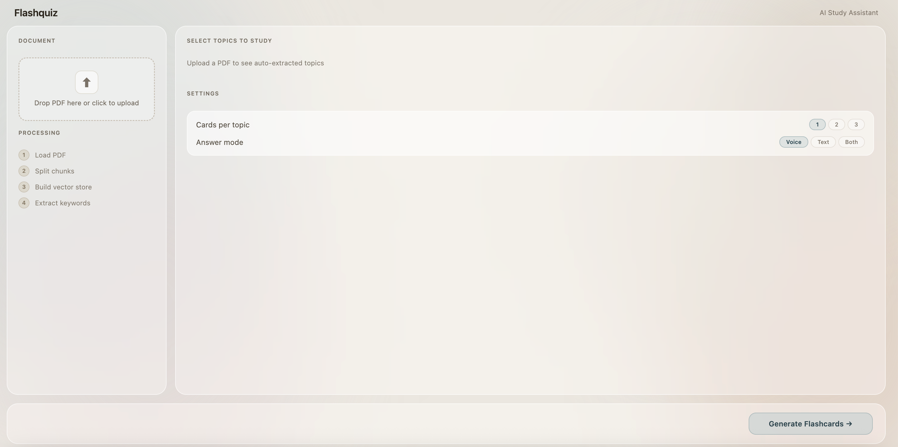
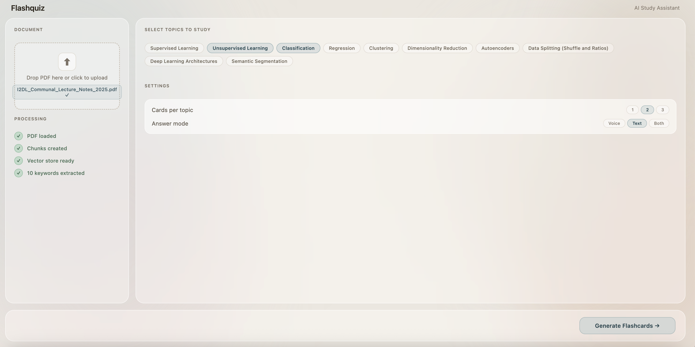
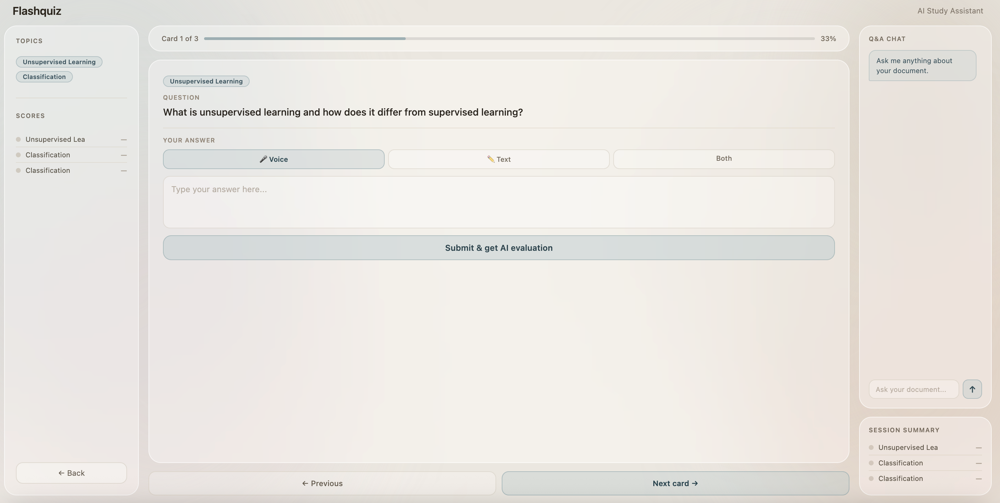

# Flashquiz RAG — AI-Powered Study Assistant

An intelligent flashcard system that uses **Retrieval-Augmented Generation (RAG)** to turn any PDF into an interactive study session. Built for the *AI in Law* course, extended into a full AI learning platform.

---

## AI Architecture

The core of Flashquiz is a RAG pipeline that grounds every AI response in the uploaded document — eliminating hallucination and ensuring answers are traceable to source material.

```
PDF → Chunking → Embedding → ChromaDB
                                 ↓
User Input → Query Embedding → Retrieval (top-k) → LLM → Response
```

**Key AI components:**

- **Embedding** — HuggingFace `all-MiniLM-L6-v2` converts document chunks and user queries into semantic vectors
- **Vector Store** — ChromaDB stores and retrieves embeddings via cosine similarity search
- **RAG Pipeline** — LangChain orchestrates the retrieve → augment → generate flow
- **LLM** — GPT via OpenAI-compatible API handles keyword extraction, flashcard generation, answer evaluation, and Q&A
- **AI Evaluator** — Compares user answers against retrieved document context and model answers, returning a structured score and feedback

---

## Features

- Upload any PDF and auto-extract key topics using LLM analysis
- Select topics and generate RAG-grounded flashcards
- Answer by voice or text
- AI evaluation with score (1–10), feedback, and model answer
- Multi-turn Q&A chat — ask anything about the document
- Session summary with retry for weak cards
- Persistent vector store — PDF only processed once

---

## Tech Stack

| Layer | Tools |
|---|---|
| RAG & Retrieval | LangChain, ChromaDB, HuggingFace Embeddings |
| LLM | OpenAI API (GPT-3.5-turbo) |
| Backend | FastAPI, Python 3.12 |
| Frontend | Vanilla HTML / CSS / JS |
| PDF Processing | LangChain PyPDFLoader |
| Config | python-dotenv |

---

## UI

Two-page frosted glass interface inspired by soft matte design:

Page 1 - Upload & Configure:



Page 2 - Study Mode:



**Page 1 — Upload & Configure**
- PDF upload zone with processing status
- Auto-extracted keyword chips (multi-select)
- Settings: cards per topic, answer mode (voice / text / both)

**Page 2 — Study Mode**
- Flashcard viewer with progress bar
- Voice recording + text input for answers
- AI evaluation with score and feedback
- Collapsible Q&A chat sidebar
- Session summary with retry wrong cards

A usability evaluation was conducted using the System Usability Scale (SUS), achieving a score of **78/100**, indicating good usability.

---

## Project Structure

```
flashcard_RAG/
├── core/
│   ├── loader.py        # PDF loading and chunking
│   ├── vectorstore.py   # ChromaDB persistence
│   ├── keywords.py      # LLM keyword extraction
│   ├── flashcard.py     # RAG flashcard generation
│   ├── qa.py            # Multi-turn Q&A
│   ├── evaluator.py     # AI answer scoring
│   └── client.py        # Unified LLM client
├── backend/
│   └── main.py          # FastAPI routes
├── frontend/
│   └── index.html       # Full UI
└── .env
```

---

## Getting Started

```bash
pip install -r requirements.txt

# Add your API keys
cp .env.example .env

# Start backend
uvicorn backend.main:app --reload --port 8000

# Open frontend
open frontend/index.html
```

---

## Environment Variables

```
OPENAI_API_KEY=your_key
LLM_BASE_URL=https://your-llm-endpoint/v1
```
## Getting Started

```bash
# Install dependencies
pip install -r requirements.txt

# Set up environment variables
cp .env.example .env
# Fill in your API key and LLM base URL

# Run the app
streamlit run ui/app.py
```

---

## Environment Variables

```
OPENAI_API_KEY=your_api_key
LLM_BASE_URL=https://your-llm-endpoint/v1
```
