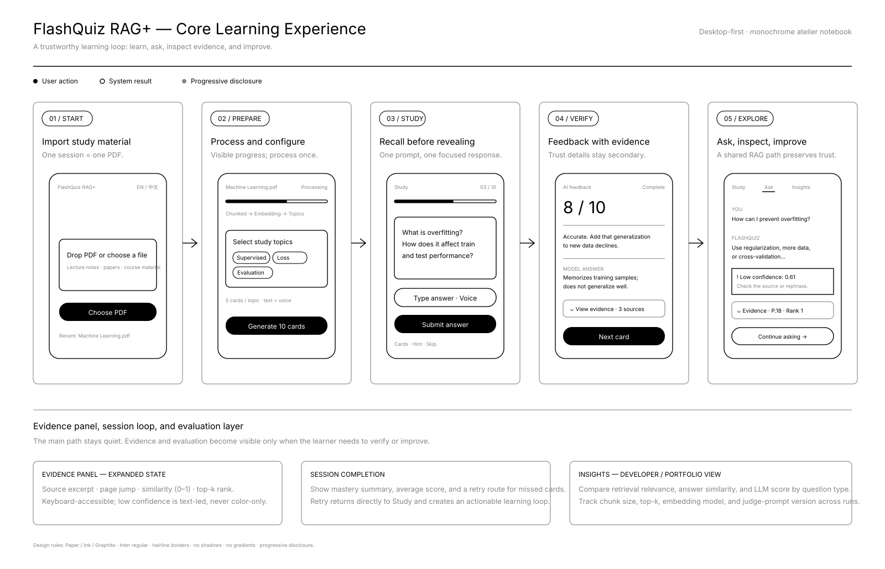
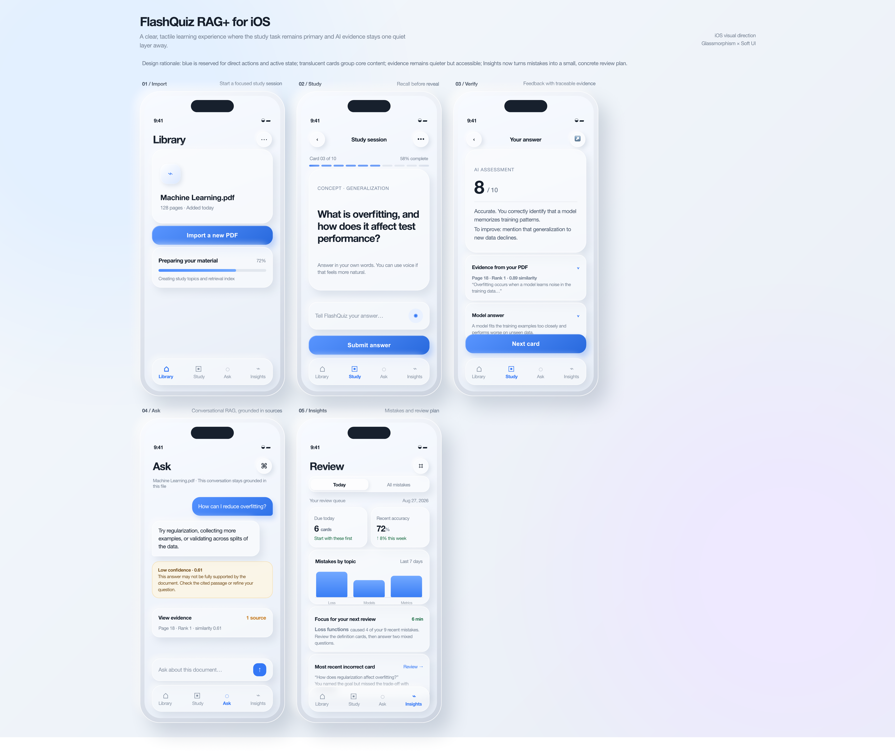

# FlashQuiz RAG+ — Design Process

FlashQuiz RAG+ is a study assistant that turns a single PDF into flashcards
and grounded Q&A — where every score and every answer traces back to the
sentence it came from. This document walks through the design process end
to end: **requirements → interaction flow → visual design**, in the order
they were actually produced.

> Full product & engineering write-up: [`PRD.md`](./PRD.md)

---

## 1. Product Requirements

The [PRD](./PRD.md) defines the product principles, information
architecture, MVP scope, and acceptance criteria. Two decisions from it
shape everything downstream in this document:

- **Traceability first.** No AI-generated answer reaches the UI without a
  visible source — a page number, a similarity score, a rank. This is a
  product principle, not a feature toggle.
- **Progressive disclosure.** The study task (flashcards, questions) stays
  the primary layer. Evidence, confidence scores, and evaluation metrics
  are one tap away, never competing with the main task for attention.

| Principle | PRD section |
|---|---|
| Evidence-first answers | §4 Product Principles |
| MVP scope (P0 / P1 / out of scope) | §6 |
| Concept data model (`RagEvent`, `EvalRecord`) | §10 |
| Acceptance criteria | §13 |

---

## 2. Interaction Flow

Before any visual design, the core loop was mapped as a five-stage flow —
**Import → Prepare → Study → Verify → Explore** — to decide *where*
evidence and evaluation should surface without disrupting the study task.



Key decisions encoded in this flow:

- **Evidence is collapsed by default** in both the Verify and Ask stages —
  expanded only on request (`⌄ View evidence`), keeping the main answer as
  the primary read.
- **Low confidence is text-led**, never color-only (e.g. *"Low confidence ·
  0.61"*), so the signal survives for screen readers and colorblind users.
- **Session completion feeds Insights** directly — every mistake becomes an
  input to a concrete, scoped review plan rather than a raw log.

---

## 3. Visual Design — iOS UI

Visual direction: **glassmorphism × soft UI**. Blue is reserved
exclusively for direct actions and active state; translucent cards group
core content; evidence stays visually quieter than the primary answer but
never hidden more than one tap away.



| Screen | Purpose | Ties back to |
|---|---|---|
| **01 · Library** | Start a focused study session; one PDF per session | PRD §7.1 |
| **02 · Study** | Recall before reveal — question first, answer second | PRD §6.1.3 |
| **03 · Verify** | Feedback with traceable evidence, collapsed by default | PRD §6.1.5 (Evidence panel) |
| **04 · Ask** | Conversational RAG, grounded in the uploaded document | PRD §6.1.4 |
| **05 · Insights** | Turns mistakes into a small, concrete review plan | PRD §6.1.7 |

**Design rationale** (from the original visual spec): blue is reserved for
direct actions and active state; translucent cards group core content;
evidence remains quieter but accessible; Insights turns mistakes into a
small, concrete review plan.

---

## Where this lives in the repo

```
├── DESIGN_PROCESS.md        ← this file
├── PRD.md                   ← full product requirements
└── assets/design/
    ├── interaction-flow.svg
    └── ui-screens.png
```

The corresponding implementation (FastAPI backend + vanilla-JS frontend)
lives in `backend/` and `frontend/` at the repo root — see the top-level
`README.md` for how to run it.
